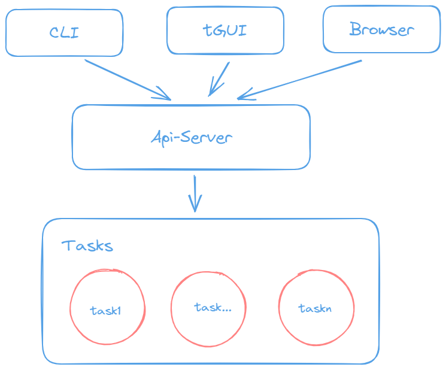

Get started
=============================

.. _readme-description:

Description
-----------

The *horizon* project is used to manage all the tools we will use.
This project originated from such a disturbing situation, in my daily work,
I need to create many tools, or write some documents. But they are scattered
and unsystematic, which causes me to spend a lot of time looking for or
modifying them every time. So I hope to create a project that can manage these
tools.

.. _readme-architecture:

Architecture
------------

The architecure of this project is shown in the figure below

I divide it into three layers, the top layer is the part displayed externally,
temporarily supports the following three forms:

* CLI
* tGUI
* Browser

They respectively represent the three ways of daily use tools, that is, command
line, terminal GUI (similar **vim** and **htop**) and browser front end.

The middle layer will provide the unified HTTP API interfaces and provide
various :doc:`connectivity protocols </protocols>` for the upper and lower
layer.

The last layer is responsible for specific work. There is a general task
service, which communicates with the middle-level api-server externally, and
is responsible for maintaining all registered tasks internally.
